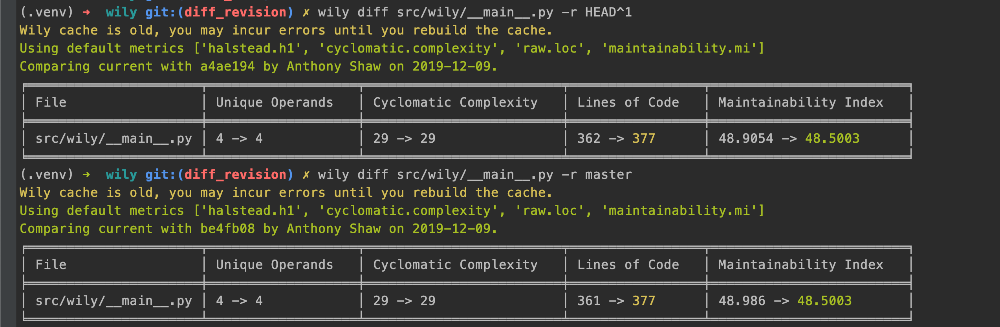

Using Wily in a CI/CD pipeline
==============================

Wily can be used in a CI/CD workflow to compare the complexity of the current files against a particular revision.

By default wily will compare against the previous revision (for a git-pre-commit hook) but you can also give a Git ref, for example `HEAD^1` is the commit before the HEAD reference.

.. code-block:: console

    $ wily build src/
    $ wily diff src/ -r HEAD^1

Or, to compare against

.. code-block:: shell

    $ wily build src/
    $ wily diff src/ -r master

The `wily diff` command takes additional arguments, such as a list of metrics, if you want to see a specific metric.

Examples
---------

Tox
+++

Wily can be run as a separate test environment:

.. code-block:: ini

    [testenv:wily]
    deps =
        wily
    commands =
        wily build src/
        wily diff src/ -r HEAD^1

Azure Pipelines
+++++++++++++++

Wily can be called as two separate tasks within a job:

.. code-block:: yaml

  - script: |
    pip install wily
    wily build src/
    displayName: Install Wily and compile cache

  - script: "wily diff src/ -r HEAD^1"
    displayName: Compare previous commit

Travis CI
+++++++++

Wily can be called after your tests have completed.

.. code-block:: yaml

  after_success:
    - pip install wily
    - wily build src/
    - wily diff src/ -r HEAD^1