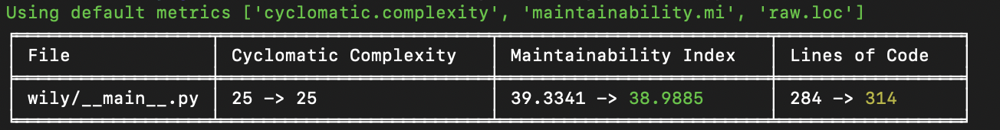

Diff Command
============

The `wily diff` command will compare the last cached revision of the code with the current metrics. It will run the default metrics for the current environment.

Examples
--------

To see the changes in metrics for a list of files, give the files to the ``wily diff`` command.

.. code-block:: none

  $ wily diff example.py example2.py src/example3.py

The diff command will only show files where the metrics have changes, to see all files regardless of changes, provide the ``--all`` flag.

.. code-block:: none

  $ wily diff example.py --all

To show specific metrics, add a combination of comma-separated ``--metrics`` flags.

.. code-block:: none

  $ wily diff example.py --metrics raw.loc,cyclomatic.complexity

Diff will show function and class-level metrics by default. To show only module-level metrics, add the ``--no-detail`` flag

.. code-block:: none

  $ wily diff example.py --no-detail

Using diff as a pre-commit hook
-------------------------------

You can install wily as a pre-commit plugin by adding the following configuration to ``.pre-commit-config.yaml``

.. code-block:: yaml

    repos:
    -   repo: local
        hooks:
        -   id: wily
            name: wily
            entry: wily diff
            verbose: true
            language: python
            additional_dependencies: [wily]

Command Line Usage
------------------

.. click:: wily.__main__:diff
   :prog: wily
   :show-nested: