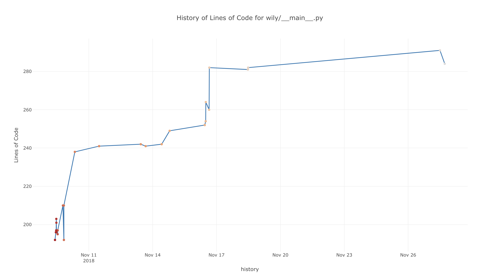
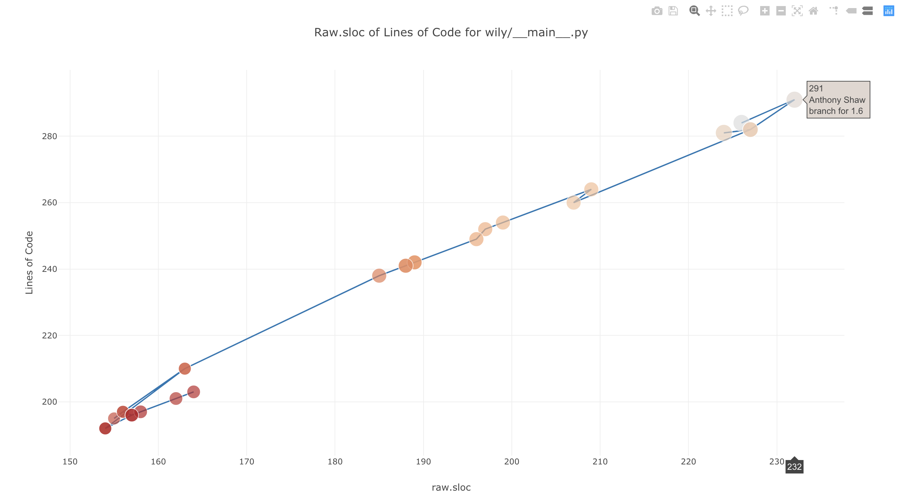

Graph Command
=============

The graph command generates HTML graphs for metrics, trends and data in the wily cache. The wily cache must be built first using the :doc:`build`.

Examples
--------

``wily graph`` will take 1 or 2 metrics as the 2nd and 3rd arguments. The first metric will be the Y-axis and the 3rd metric (if provided) will control the size of the bubble.

.. code-block:: none

   $ wily graph example.py raw.loc

You can provide a second metric which will be used to control the size of the bubbles on the scatter diagram.

.. code-block:: none

   $ wily graph example.py raw.loc cyclomatic.complexity

.. image:: ../_static/two_metric_graph.png
   :align: center

The x-axis will be the historic revisions (typically git commits) on a scale of the revision date. You can change the x-axis to a specific metric. If you do so, the color of the bubble will get darker as the revisions go from 0-n, where n is the last revision.

.. code-block:: none

   $ wily graph example.py raw.loc cyclomatic.complexity --x-axis raw.sloc

By default, ``wily graph`` will create a file, ``wily-report.html`` in the current directory and open it using the browser configured in the $BROWSER environment variable (the default on the OS).
To save the output to a specific HTML file and not open it, provide the ``-o`` flag and the name of the output file.

.. code-block:: none

   $ wily report example.py raw.loc -o example.html

Command Line Usage
------------------

.. click:: wily.__main__:graph
   :prog: wily
   :show-nested: