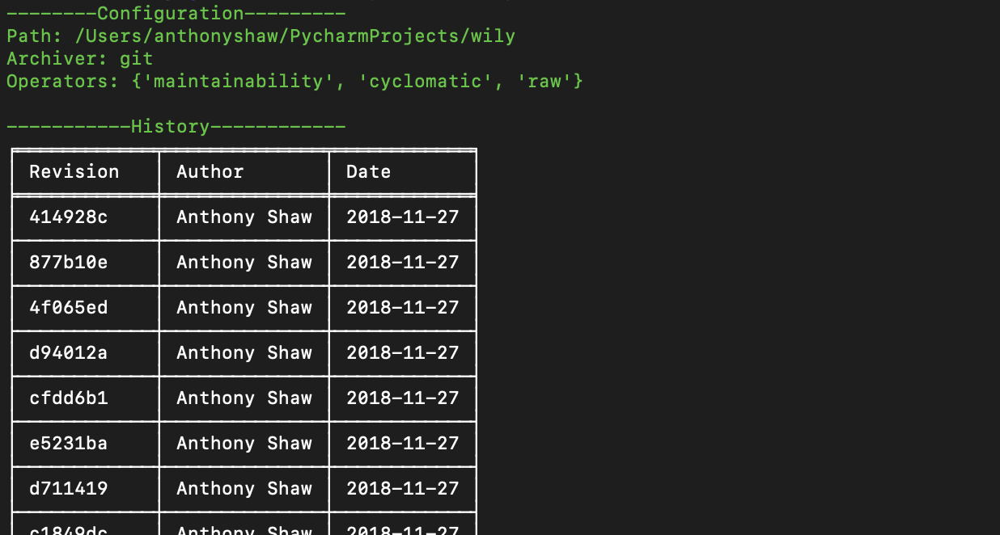

Index Command
=============

The index command will display all revisions that have been analysed inside the available wily cache folder.

Examples
--------

To get a list of revisions in the cache,

.. code-block:: none

  $ wily index

By default, the index command will show the author of the revision, the date and the first 7 characters of the SHA.

To show the commit message, add the ``--message`` flag

.. code-block:: none

  $ wily index --message

Command Line Usage
------------------

.. click:: wily.__main__:index
   :prog: wily
   :show-nested: