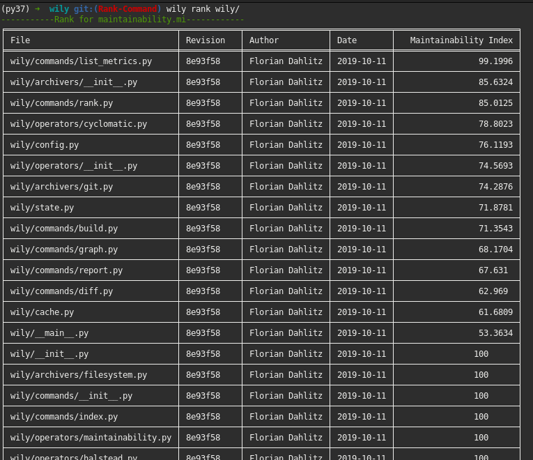

Rank Command
==============

The rank command will show a CLI table of files in order of their respective metric values. It is useful for identifying e.g. complex files.

Examples
--------

To show all files in the index, simply use ``wily rank`` without arguments.

.. code-block:: none

  $ wily rank

To display a file ranking, simply provide the path to a directory.

.. code-block:: none

  $ wily rank src/

By default, wily will show the default metric (maintainability index).

To change the metric, provide the metric name (run ``wily list-metrics`` for a list) as argument.

.. code-block:: none

  $ wily rank src/ loc

Wily rank will show the last revision by default. If you want to show a specific revision, you can provide the reference of a revision via ``--revision``.

.. code-block:: none

  $ wily rank src/ --revision HEAD^2

Wily rank will exit with 0 by default if no error occurs. However, you can set a custom threshold. If the total value is below the specified threshold,
the rank command will return a non-zero exit code.

.. code-block:: none
  $ wily rank --threshold=80

Command Line Usage
------------------

.. click:: wily.__main__:rank
   :prog: wily
   :show-nested: