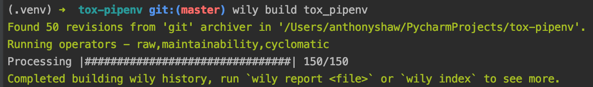
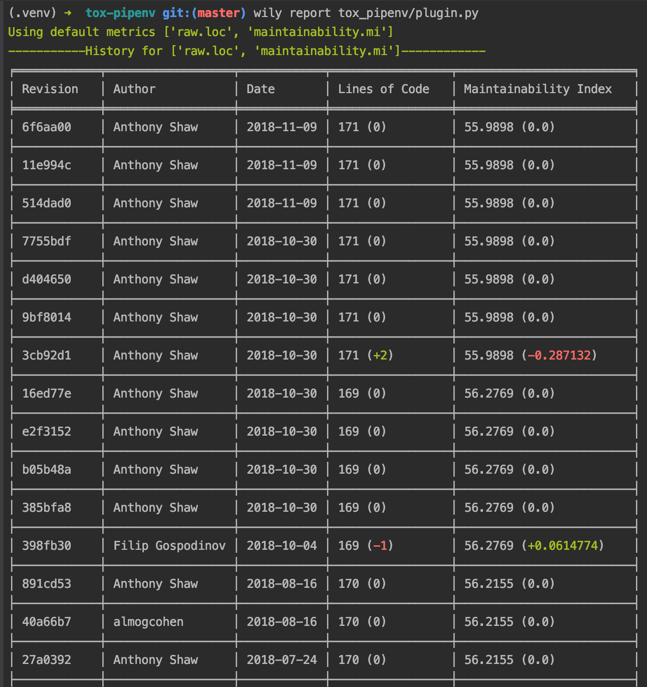

.. wily documentation master file, created by
   sphinx-quickstart on Wed Nov  7 15:11:13 2018.
   You can adapt this file completely to your liking, but it should at least
   contain the root `toctree` directive.

A Python application for tracking, reporting on timing and complexity in tests and applications.

.. image:: https://readthedocs.org/projects/wily/badge/?version=latest
    :target: https://wily.readthedocs.io/en/latest/?badge=latest
    :alt: Documentation Status
.. image:: https://badge.fury.io/py/wily.svg
    :target: https://badge.fury.io/py/wily

Wily uses git to go through each revision (commit) in a branch and run complexity and code-analysis metrics over the code. You can use this to limit your code or report on trends for complexity, length etc.

.. toctree::
   :maxdepth: 1
   :caption: Contents:

   commands/build
   commands/diff
   commands/graph
   commands/index
   commands/report

What is wily?
-------------

Wily is a command-line tool for archiving, exploring and graphing the complexity of Python source code.

Wily supports iterating over a git repository and indexing the complexity of the Python source files using a number of algorithms. You can then report on those in the console or graph them to a browser.

Getting Started
---------------

You can install wily from PyPi using pip

.. code-block:: console

   $ pip install wily

Wily needs an index of the project before any of the commands can be used. :doc:`commands/build` builds an index in a Git repository. Provide the path to your source code as the first argument.

.. code-block:: console

   $ wily build src/

You can provide multiple source directories, such as your test projects.

.. code-block:: console

   $ wily build src/ test/

See :doc:`commands/build` for more details on the build command.

Now that you have an index, you can run `wily report` or `wily graph` to see the data.

You can display any of the metrics in a HTML graph by running the graph command with the path to the file and the metric

.. code-block:: console

   $ wily graph wily/__main__.py raw.loc

.. image:: _static/single_metric_graph.png
   :align: center

See :doc:`commands/report` and :doc:`commands/graph` for more details on the report and graph commands.

To get a list of available metrics, run:

.. code-block:: console

   $ wily list-metrics

Pre-commit hook
---------------

You can install wily as a pre-commit plugin.

.. code-block:: yaml

    repos:
    -   repo: local
        hooks:
        -   id: wily
            name: wily
            entry: wily diff
            verbose: true
            language: python
            additional_dependencies: [wily]

"cute animal doing dabbing" [Designed by Freepik](https://www.freepik.com/free-vector/cute-animal-doing-dabbing_2462508.htm)