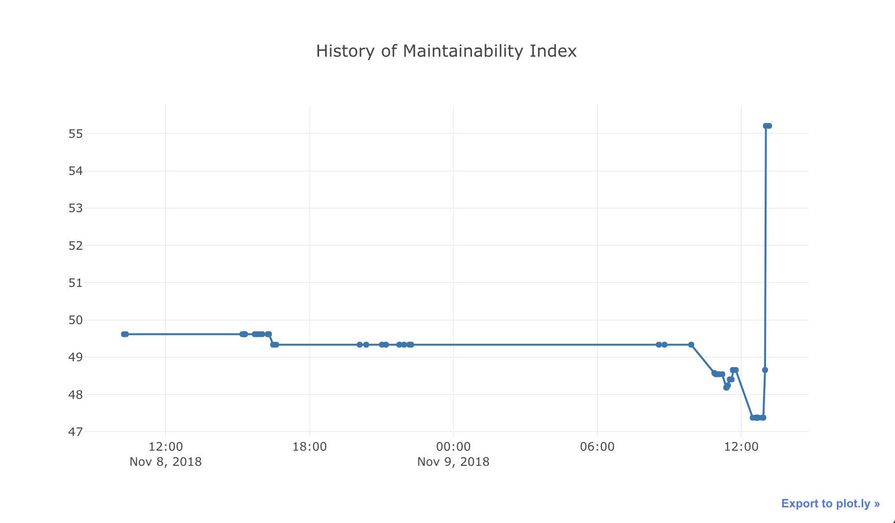

.. wily documentation master file, created by
   sphinx-quickstart on Wed Nov  7 15:11:13 2018.
   You can adapt this file completely to your liking, but it should at least
   contain the root `toctree` directive.

.. image:: _static/logo.png
   :align: center

A Python application for tracking, reporting on timing and complexity in tests and applications.

Wily uses git to go through each revision (commit) in a branch and run complexity and code-analysis metrics over the code. You can use this to limit your code or report on trends for complexity, length etc.

.. toctree::
   :maxdepth: 2
   :caption: Contents:

What is wily?
-------------

Wily is a command-line tool for archiving, exploring and graphing the complexity of Python source code.

Wily supports iterating over a git repository and indexing the complexity of the Python source files using a number of algorithms. You can then report on those in the console or graph them to a browser.

Getting Started
---------------

You can install wily from PyPi using pip

.. code-block:: console

   $ pip install wily

Wily needs an index of the project before any of the commands can be used. `wily build` builds an index in a Git repository. Provide the path to your source code as the first argument.

.. warning::

   Before you run wily, add `.wily/` to your .gitignore file and commit it. Wily will warn you if this is missing.

.. code-block:: console

   $ wily build src/

You can provide multiple source directories, such as your test projects.

.. code-block:: console

   $ wily build src/ test/

Now that you have an index, you can run `wily report` or `wily graph` to see the data.

.. code-block:: console

   $ wily report wily/__main__.py -n 5

   Using default metrics ['maintainability.mi', 'raw.loc']
   -----------History for ['maintainability.mi', 'raw.loc']------------
   ╒════════════╤══════════════╤════════════╤═════════════════════════╤═════════════════╕
   │ Revision   │ Author       │ Date       │ Maintainability Index   │ Lines of Code   │
   ╞════════════╪══════════════╪════════════╪═════════════════════════╪═════════════════╡
   │ 9d6c3fa    │ Anthony Shaw │ 2018-11-09 │ 55.2078 (0.0)           │ 210 (0)         │
   ├────────────┼──────────────┼────────────┼─────────────────────────┼─────────────────┤
   │ 5f168ae    │ Anthony Shaw │ 2018-11-09 │ 55.2078 (+6.55007)      │ 210 (+13)       │
   ├────────────┼──────────────┼────────────┼─────────────────────────┼─────────────────┤
   │ 580a3ec    │ Anthony Shaw │ 2018-11-09 │ 48.6577 (+1.27916)      │ 197 (+2)        │
   ├────────────┼──────────────┼────────────┼─────────────────────────┼─────────────────┤
   │ a48a110    │ Anthony Shaw │ 2018-11-09 │ 47.3786 (0.0)           │ 195 (0)         │
   ├────────────┼──────────────┼────────────┼─────────────────────────┼─────────────────┤
   │ f61fc69    │ Anthony Shaw │ 2018-11-09 │ 47.3786 (0)             │ 195 (0)         │
   ╘════════════╧══════════════╧════════════╧═════════════════════════╧═════════════════╛

You can display any of the metrics in a HTML graph by running the graph command with the path to the file and the metric

.. code-block:: console

   $ wily graph wily/__main__.py maintainability.mi

To get a list of available metrics, run:

.. code-block:: console

   $ wily list-metrics

Command Line Usage
------------------

.. click:: wily.__main__:cli
   :prog: wily
   :show-nested:

"cute animal doing dabbing" [Designed by Freepik](https://www.freepik.com/free-vector/cute-animal-doing-dabbing_2462508.htm)